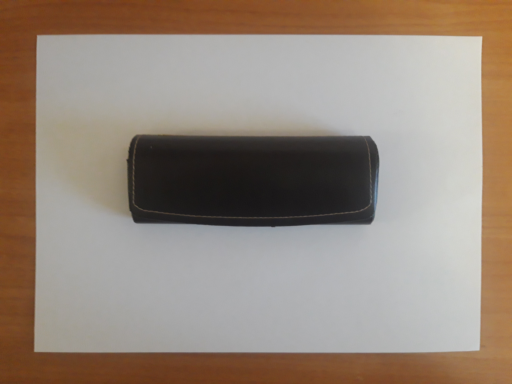
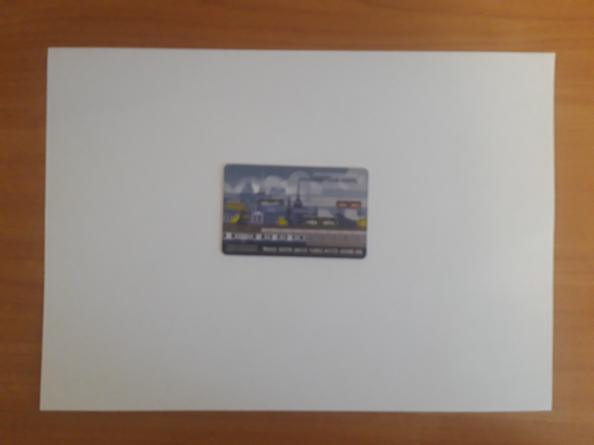
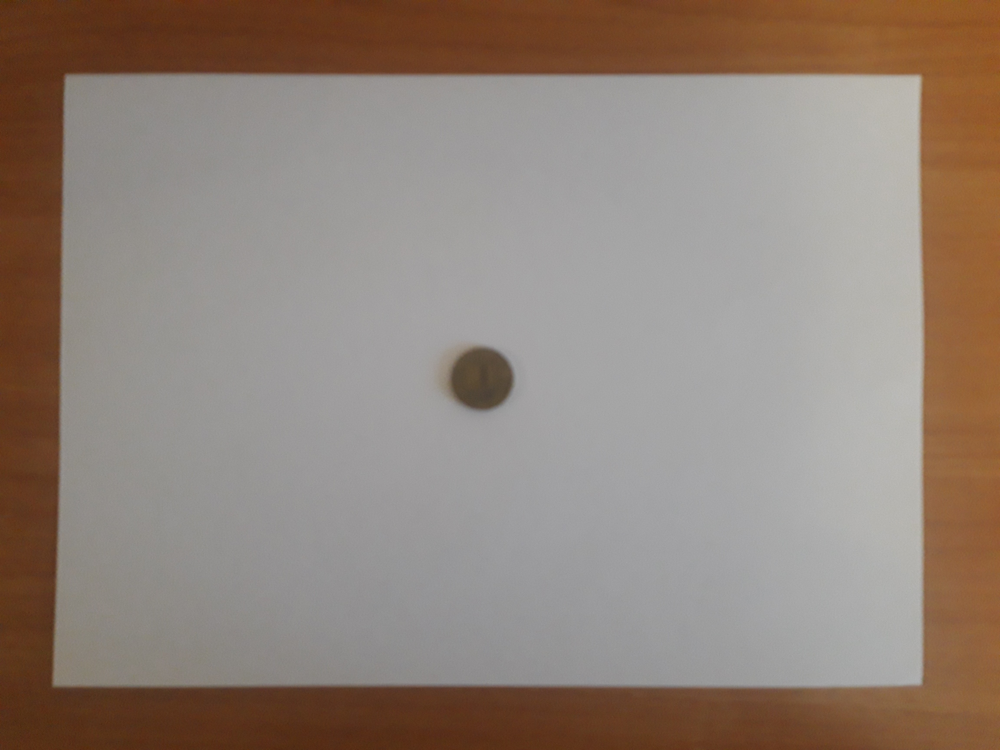
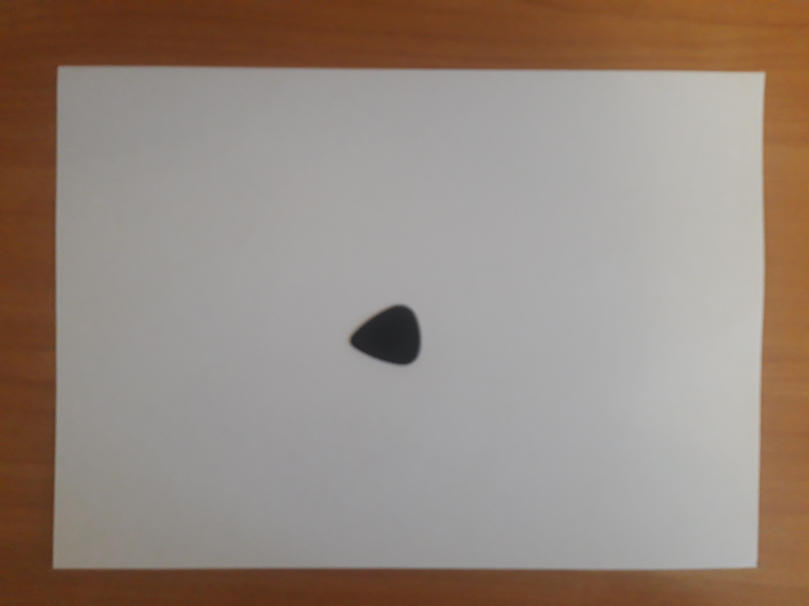

# Intelligent Placer

## Постановка задачи

Имеется фотография подмножества предметов фиксированного множества и многоугольник. Необходимо определить, можно ли расположить все предметы в многоугольнике.

### Требования к фотографии предметов

1. предметы не должны пересекаться
2. предметы должны иметь четко выраженные границы (между предметами должна существовать цепочка из соседних пикселей разделяющая предметы на фото)
3. Камера направлена перпендикулярно к поверхности, на которой расположены предмены
4. Все предмепы расположены лицевой поверхностью вверх (как на фото выше)
6. Все предметы должны быть полностью видны на фото 
7. Предметы должны располагаться на белой поверхности
8. Один объект может присутствовать на фото один раз

### Способ задания многоугольника
1. Многоугольник задается списком координат вершин
2. Соседние вершины многоугольника должны идти подряд в списке вершин (первая идет за последней)
3. Координаты вершин многоугольника соовтветствуют сантимертам на естественной плоскости

### Набор предметов

